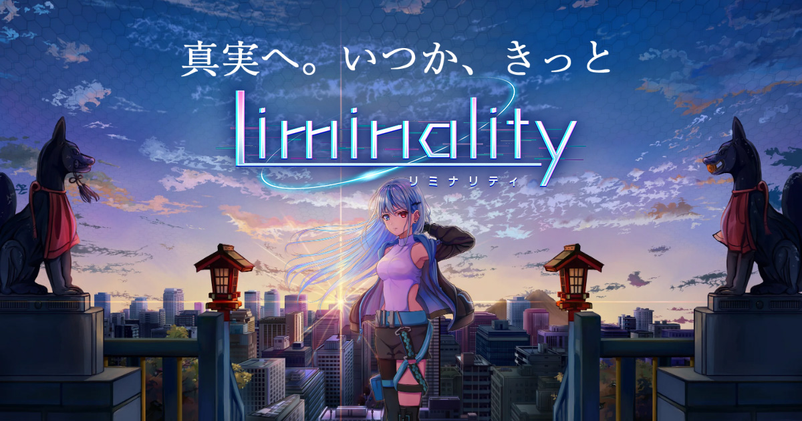
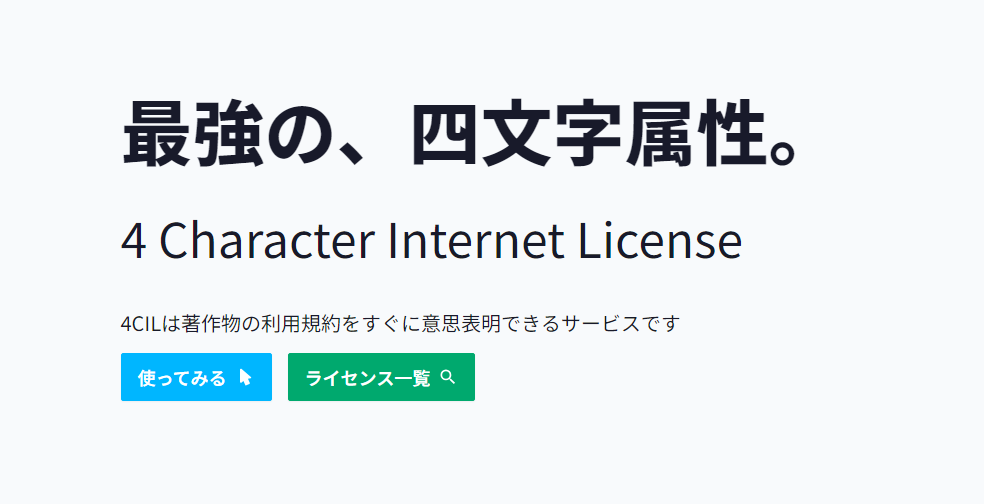
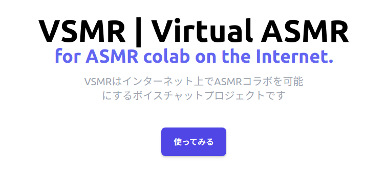
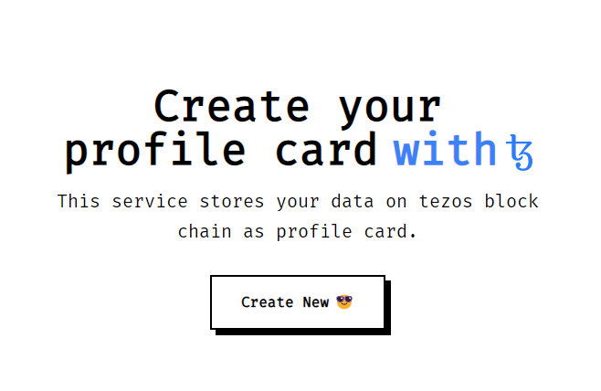

# Hi there 👋

  
  

# My skills✨

## Languages & Libraries
### HTML / CSS / JS

### Python

### Go

### PHP

### C / C++

### Ruby

### Other

### Markup

## Database / ORM
### Database

### ORM

## Tools
### Programming

### Git

### CI / CD

### Platform (Public Cloud / PaaS)

### Design

### IDE / Editor

### Adobe

### DAW

## Server / Software / Other
### Server / LoadBalancer / Cache

### Hypervisor

### Network

### OS

## I'm learning ✏️

## I wanna learn 📖

## Skills / Qualifications
- 2020/12 [Applied Information Technology Engineer Examination](https://www.ipa.go.jp/shiken/kubun/ap.html)
- 2021/06 [Registered Information Security Specialist Examination](https://www.ipa.go.jp/shiken/kubun/sc.html)
- 2021/10 Registered Information Security Specialist
- 2022/06 [Network Specialist Examination](https://www.ipa.go.jp/shiken/kubun/nw.html)
- 2024/06 Test of English for International Communication  - score 765

# JoinedProject
<!--I have joined in several projects. However I am looking for work. It's time to do something new.-->
(*ΦωΦ)੭⁾⁾✨

# My Personal Project

This is a project I am personally working on or collaborating on as a hobby.

## Sound Imagine
[sound-imagine](https://github.com/398noe/sound-imagine)  
Sound Imagine is audio analyzer for mixing. It performs an FFT on the input audio and plots the frequency, Mid-Side, and L-R components in 3D space to characterize the sound source.

2024/06~now (need help 🩹)

## Liminality | Rhythm Game

[https://liminality.ninja](https://liminality.ninja)  
Liminality is a music game for smartphones featuring semi-circle shaped lanes. I am the composer, web engineer and server side engineer for this game.

2019/04~now (released✨)  

## 4CIL | 4 Character Internet License

[https://github.com/398noe/4cil](https://github.com/398noe/4cil)  
4CIL is a service that allows you to immediately declare your intention to use the terms of use of copyrighted works. written with typescript.

2022/04~now (updated✨)

## VSMR | Virtual ASMR

[https://github.com/VSMR](https://github.com/VSMR)  
VSMR is voice chat project for binaural collaboration on the Internet. written with typescript.

2020/04~now (will be update within 6-months👀)

## hais.in | URL shortener service for live streamer

[https://github.com/haisin-official](https://github.com/haisin-official)  
hais.in is the URL shortener service for live streamer. written with golang.

2023/02~now (will be update within 6-months👀)

## Tourette Lab (private personal project)

[https://github.com/398noe/tourette-lab](https://github.com/398noe/tourette-lab)  
Collection of tools for the Tourette Syndrome or Vocal Tic. Make a SVM model and infer which can predict whether input sound is a vocal tic or not. written with python and c++.

2024/04 ～ now (in progress👀)

---

## Tezos Card

[https://github.com/398noe/tezos-card](https://github.com/398noe/tezos-card)  
Tezos card stores your data on tezos block chain as profile card.

2022/11  

## Suru
[https://github.com/398noe/suru](https://github.com/398noe/suru)  
Suru is superior entity to siri😎 Suru supports voice input and reads the output of OpenAI.

2023/01

<!--
**398noe/398noe** is a ✨ _special_ ✨ repository because its `README.md` (this file) appears on your GitHub profile.

Here are some ideas to get you started:

- 🔭 I’m currently working on ...
- 🌱 I’m currently learning ...
- 👯 I’m looking to collaborate on ...
- 🤔 I’m looking for help with ...
- 💬 Ask me about ...
- 📫 How to reach me: ...
- 😄 Pronouns: ...
- ⚡ Fun fact: ...
-->
